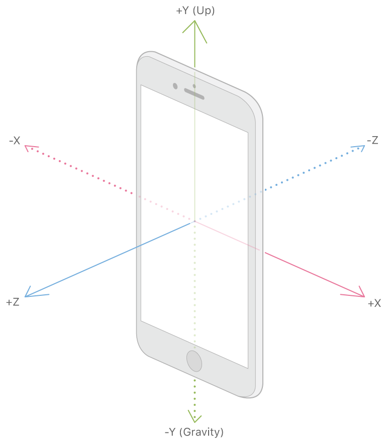

## React Native ARKit
The React Native binding for iOS ARTKIT

---

### iOS ARKit
* Visual Inertial Odometry (VIO) fuses camera sensor data with Core Motion data
* Scene Understanding and Lighting Estimation
* Only devices with A9 or later processors (iPhone 6s/7/SE/8/X, iPad 2017/Pro) on iOS 11
* ARKit in Metal, SceneKit, and third-party tools like Unity and Unreal Engine
* TrueDepth Camera

---

### ARKit Component
```javascript
  <ARKit
    debug
    planeDetection
    lightEstimationEnabled
    origin={{position: {0,-1, 0}, transition: {duration: 1}}}
    onLightEstimation={e => console.log(e.nativeEvent)}
    // Better to use polling with ARKit.getCurrentLightEstimation()
    onPlaneDetected={console.log}
    onPlaneUpdate={console.log}
    onPlaneRemoved={console.log}
    onARKitError={console.log}
    onFeaturesDetected={console.log}
    // Can also poll with ARKit.getCurrentDetectedFeaturePoints()
  >
```

---

### WorldAlignment
* gravity
* gravityAndHeading
* camera

---



---

### Components
* Box, Sphere, Cylinder, Cone, Pyramid, Tube, Torus, Capsule, Text, Light, Model (.scn file), Shape (svg)

```javascript
<ARKit.Box
  position={{ x: 0, y: 0, z: 0 }}
  eulerAngles={{ x: -Math.PI / 2 }}
  // rotation upon X is pitch, Y is yaw and Z is roll
  shape={{ width: 0.1, height: 0.1, length: 0.1, chamfer: 0 }}
  material={{
    diffuse: { path: image, intensity: 1 },
    // metalness, roughness, lightingModel, shaders
  }}
  categoryBitMask={1}
  castsShadow
/>
```

---

### withProjectedPosition HOC
```javascript
const PlaneCursor = withProjectedPosition()(({ positionProjected }) => {
  if (!positionProjected) return null;
  return (
    <ARKit.Sphere
      position={positionProjected}
      transition={{ duration: 0.1 }}
      shape={{ radius: 0.05 }}
      material={{
        lightingModel: ARKit.LightingModel.Constant,
        color: "#4C92EF"
      }}
    />
  );
});

<PlaneCursor
  projectPosition={{
    x: windowWidth / 2,
    y: windowHeight / 2,
    // take furthest detected feature plane
    // (if you have a table and the ground, it'll use the ground)
    plane: results =>
      results.length > 0 ? results[results.length - 1] : null
  }}
/>
```

---

### Static Methods
* snapshot
* snapshotCamera
* getCameraPosition (position of ARCamera)
* getCamera (ARCamera)
* getCurrentLightEstimation (`{ ambientColorTemperature, ambientIntensity }`)
* getCurrentDetectedFeaturePoints (array)
* focusScene
* hitTestPlanes(point, type)
* hitTestSceneObjects(point)

---

### hitTestPlanes
```javascript
ARKit.hitTestPlanes(
  {
    x: width / 2,
    y: height / 2
  },
  ARKit.ARHitTestResultType.ExistingPlane
  // ARHitTestResultTypeExistingPlaneUsingExtent
  // ARHitTestResultTypeEstimatedHorizontalPlane
  // ARHitTestResultTypeFeaturePoint
).then(({ results }) => {
  if (results.length <= 0) return;

  this.setState({ wallPosition: results[results.length - 1].position });
});
```

---

### Questions?
